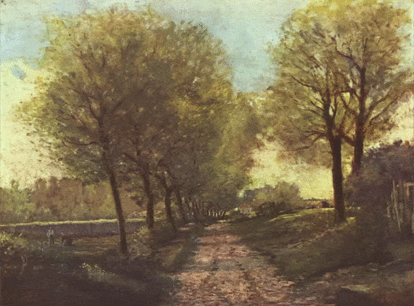

# Rapport de stage IRISA

Rapport de stage ESIR2 à l'IRISA pour le stage sur l'Étude et modèle prédictif de la saillance sur des œuvres d’art.

Click [here](https://drive.google.com/file/d/12EfGLIaQ0pg4ddWsy4Nmons33vnFxjhH/view?usp=sharing) to download final result videos.

Click [here](master.pdf) to see the report.

Here some exemple of videos explain in the report:

### Fading video

<html>
<body>

</body>
</html>

### Scanpath animated

<html>
<body>

</body>
</html>

### Ken burns effect

<html>
<body>

</body>
</html>

### Ken Burns effect + captioning

<html>
<body>

</body>
</html>
